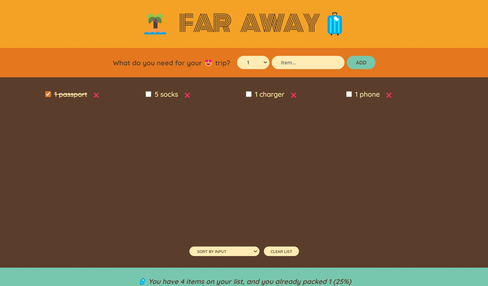

# TravelApp
The TravelApp application is bootstrapped with CRA version 5. It allows users to make a list of items that they need to pack to go on a holiday. They can also mark their items as packed or delete the items off the list. The users can also sort the items by the order of the items input, by the item description and packed status. The app also provides stats to the user by informing them how many items there are on the list, how many of those items have been packed and the percentage of items packed.

## Features
- Add items to the list.
- Delete and sort items.
- View stats on how many items have been packed.
- Clear the entire list.

### `npm start`

Runs the app in the development mode.\
Open [http://localhost:3000](http://localhost:3000) to view it in your browser.
